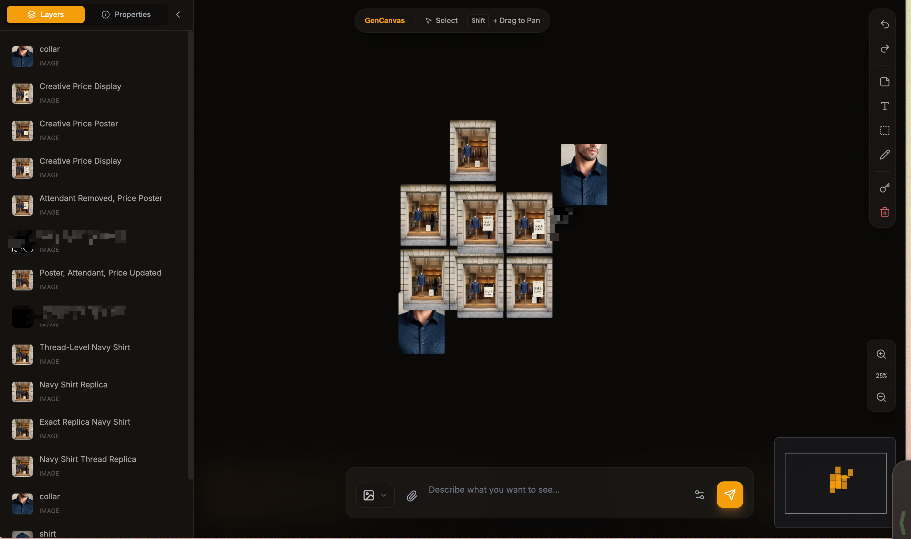

# GenCanvas

An infinite canvas for AI-powered image, video, and audio generation. Bring your own Gemini API key, generate what you want, arrange it how you want.

**Live Demo:** https://gencanvas.netlify.app



## Why GenCanvas?

Most AI generation platforms lock you into chat interfaces, charge margins on top of API costs, and block harmless generations with overzealous moderation. GenCanvas takes a different approach:

- **BYOK (Bring Your Own Key)** — Your Gemini API key stays in your browser's localStorage. It never touches a server. You pay only API costs, no middleman.
- **Canvas-first UX** — Think spatially. Drag layers around, arrange compositions, iterate visually. No more scrolling through chat history.
- **Full Gemini suite** — Access image generation (Imagen 3 / Nano Banana Pro), video generation (Veo 2), and text-to-speech in one workspace.

## Features

**Generation**
- Text-to-image with Gemini Flash and Pro models
- Text-to-video and image-to-video with Veo 2
- Frame interpolation between two images
- Reference images for video generation (up to 3)
- Text-to-speech with multiple voice options

**Canvas**
- Infinite pan and zoom
- Layer system with groups and z-ordering
- Drag to reposition, resize with aspect ratio lock
- Draw annotations and text overlays on any layer
- Use any generated content as input for new generations

**Workflow**
- Persistent state via IndexedDB — your canvas survives browser restarts
- Undo/redo history (Ctrl+Z / Ctrl+Shift+Z)
- Minimap for navigation
- Level-of-detail thumbnails for performance

## Getting Started

### Use the hosted version

Visit https://gencanvas.netlify.app, enter your Gemini API key, and start generating.

Get a free API key from [Google AI Studio](https://aistudio.google.com/apikey).

### Run locally

```bash
git clone https://github.com/gupsammy/gencanvas.git
cd gencanvas
npm install
npm run dev
```

You'll be prompted for your API key on first launch. Alternatively, create `.env.local`:

```
GEMINI_API_KEY=your_key_here
```

## Controls

| Action | Input |
|--------|-------|
| Pan | Shift + drag or middle mouse button |
| Zoom | Ctrl/Cmd + scroll wheel |
| Select layer | Click |
| Multi-select | Ctrl/Cmd + click |
| Undo | Ctrl/Cmd + Z |
| Redo | Ctrl/Cmd + Shift + Z |

## Tech Stack

- React 19 + TypeScript
- Vite
- Google GenAI SDK
- IndexedDB for persistence
- Tailwind CSS

## License

MIT — see [LICENSE](LICENSE)

## Contributing

Issues and PRs welcome. This is a personal project, so response times may vary.
